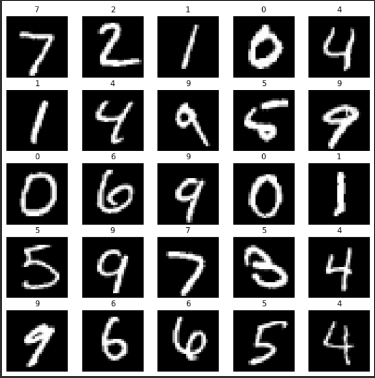

# MATH214-PROJECT: Gradient Descent in CNN


## PGROUP-1 Members
| Id           | Chinese Name | English Name |
| ------------ | ------------ | ------------ |
| 522370910184 | 何哲文       | He Zhewen    |
| 521370910163         | 梁而道       | Liang Erdao  |
|     521021910120        | 王逸骏       | Wang Yijun   |
|    522370910129          | 袁艺蕾       | Yuan yilei   |
## Introduction
### Project
Our application uses a CNN model to predict handwritten digits in the MNIST dataset. MNIST is a well-known dataset used for image recognition and classification tasks. It consists of 70,000 handwritten digits in grayscale images of 28x28 pixels.
### Structure
```
assets   ==>   MNIST dataset folder
docs     ==>   Project Paper/PPT/LaTex code
models   ==>   Trained CNN models
src      ==>   Source code folder
```
### Results
* Testing set prediction

* Accuracy
accuracy = `98.67%`


## Run & Deploy
```bash
git clone https://github.com/openhe-hub/math214-project.git
cd math214-project
pip install -r requirements.txt
```
